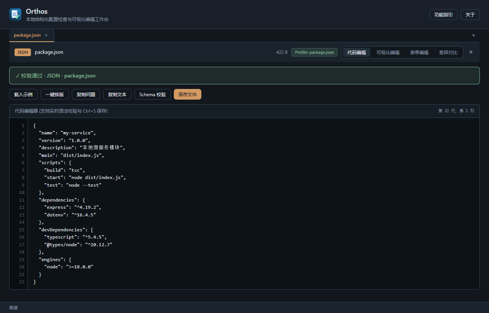

# Orthos — 离线配置文件检查与安全修复工具

> **把敏感配置留在本地。不用云端上传，告别配置泄漏隐患。**

[简体中文](README.md) | [English](README.en.md) · [下载 Windows 最新版](https://github.com/rowanjove/Orthos/releases/latest) · [更新日志](CHANGELOG.md) · [反馈问题](https://github.com/rowanjove/Orthos/issues)

[](https://github.com/rowanjove/Orthos/actions/workflows/ci.yml)
[](https://github.com/rowanjove/Orthos/releases/latest)


[](LICENSE)

Orthos 是一款面向开发与运维人员的 **100% 纯本地离线** 配置文件校验工具。

你是否经常遇到应用启动失败却找不到哪行缩进有误？又或者手握包含数据库密码、云厂商 API Key 的机密配置文件，不敢粘贴到公网在线校验网站？Orthos 专为此而生：把文件拖入窗口或直接粘贴文本，毫秒级定位语法错误，提供上下文高亮与清晰说明，并提供安全的修改前后 Diff 预览。

---

## 核心能力

| 能力 | 说明 |
| :--- | :--- |
| 🗂️ **支持 7 种主流格式** | 完整覆盖 **JSON、YAML、TOML、XML、CSV、INI、ENV**，格式切换自如 |
| 🔍 **智能自动识别** | 拖入文件自动根据后缀或内容结构推断格式，亦支持手动随时指定 |
| 📍 **精准错误定位** | 告别模糊报错！直观标注出错行号、列号、附近原文代码段与中文解析 |
| 🛡️ **安全 Diff 修复** | 常见语法错漏一键自动修复，必须通过二次解析方可保存，绝不强制覆盖原文件 |
| 📦 **批量极速处理** | 支持多文件批量拖拽扫描，一次性排查整个项目的配置文件健康状况 |
| 🔒 **绝对本地离线** | 不联网、无遥测、不调用云端接口，企业内网机密配置放心检查 |

---

## 下载与使用

当前版本：**v1.1.0**（支持 Windows 10/11 x64）：

* **[免安装便携版]**：`Orthos_1.1.0_x64_portable.exe`（下载即用，不留痕迹）
* **[完整安装版]**：`Orthos_1.1.0_x64-setup.exe`（自动创建开始菜单与关联）
* 前往 **[Releases 页面](https://github.com/rowanjove/Orthos/releases/latest)** 下载，并可核对配套的 `SHA256SUMS.txt` 校验和。

---

## 安全设计原则

* **不瞎猜、不破坏**：重复 Key 提示手动抉择，不粗暴猜测覆盖；不为了强行通过检查而擅自删改字段。
* **二次校验门禁**：任何自动修复内容必须在内存中再次通过真实 Parser 验证，才会生成保存入口。
* **零网络外联**：JSON Schema 校验纯本地解析，不向外网发起任何 HTTP 引用请求。

---

## 从源码构建

需要 Rust stable、Node.js 18+ 以及 Visual Studio C++ 构建工具：

```powershell
# 克隆仓库
git clone https://github.com/rowanjove/Orthos.git
cd Orthos

# 安装前端依赖并启动桌面端开发模式
npm ci
npx tauri dev

# 打包生产安装包
npx tauri build --bundles nsis
```

---

## 开源协议

本项目采用 [Apache-2.0 License](LICENSE) 开源。
